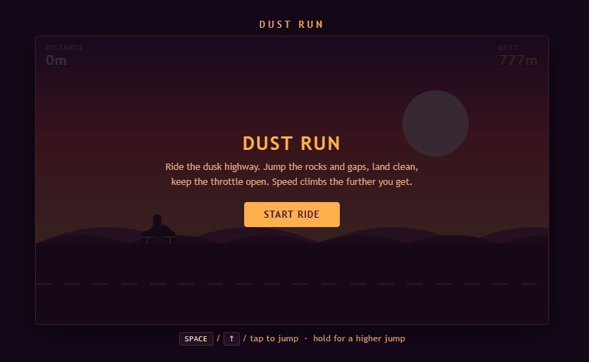

---

# 🌟 Features

✅ Endless runner gameplay

✅ Beautiful sunset desert environment

✅ Smooth HTML5 Canvas animations

✅ Progressive difficulty increase

✅ Random obstacle generation

✅ Hold-to-jump mechanic

✅ Mobile touch controls

✅ Keyboard controls

✅ Local high-score saving

✅ Responsive design

---

# 📸 Screenshots

## Home Screen

## Gameplay

## Game Over

> Save these images inside the `assets/` folder.

---

# 🎥 Gameplay GIF

Experience Dust Run in action!

> Record a 5–10 second GIF using ScreenToGif, OBS Studio, or LICEcap and save it as `assets/gameplay.gif`.

---

# 🗺️ Roadmap

### Version 1.1
- [ ] Sound effects
- [ ] Background music
- [ ] Pause menu
- [ ] Restart shortcut

### Version 1.2
- [ ] New desert themes
- [ ] Coin collection
- [ ] Score multiplier
- [ ] Power-ups

### Version 1.3
- [ ] Multiple bikes
- [ ] Bike customization
- [ ] Achievement system
- [ ] Daily challenges

### Version 2.0
- [ ] Online leaderboard
- [ ] Cloud save
- [ ] Multiplayer mode
- [ ] Boss challenges

---

# 🐞 Known Issues

- Rare collision edge cases at high speeds.
- No audio in the current version.
- Game progress is stored only in the browser's Local Storage.
- Refreshing the browser resets the current run.
- Landscape orientation provides the best gameplay on mobile devices.

---

# 📄 Changelog

## v1.0.0 — Initial Release

### Added

- Endless runner gameplay
- Jump mechanics
- Desert environment
- Distance scoring
- Best score saving
- Mobile controls
- Responsive UI
- Increasing game speed

---

## Upcoming

### Planned

- Audio effects
- New obstacles
- Better animations
- Visual effects
- Unlockable bikes
- Settings menu

---

# 🙌 Credits

### 👨‍💻 Development

Designed & Developed by **Your Name**

### 🎨 Art & Design

Original graphics created using HTML5 Canvas.

### 💻 Technologies

- HTML5
- CSS3
- JavaScript
- Canvas API

### ❤️ Special Thanks

Thanks to everyone who plays, stars ⭐ the repository, reports bugs, and contributes improvements.

---

# ⭐ Show Your Support

If you enjoyed this project, please consider giving it a **⭐ Star** on GitHub.

It motivates future updates and helps others discover the project.

---

## 📬 Feedback

Have an idea or found a bug?

Feel free to open an **Issue** or submit a **Pull Request**.

Contributions are always welcome!

---

## 🚀 Future Vision

Dust Run is planned to evolve into a complete browser arcade game featuring:

- 🎵 Dynamic music
- 🌎 Multiple worlds
- 🏍️ Unlockable vehicles
- 🎁 Rewards & achievements
- 🏆 Online leaderboards
- ☁️ Cloud save
- 🎮 Controller support
- 🌙 Dynamic weather & day/night cycle

Stay tuned for exciting updates!